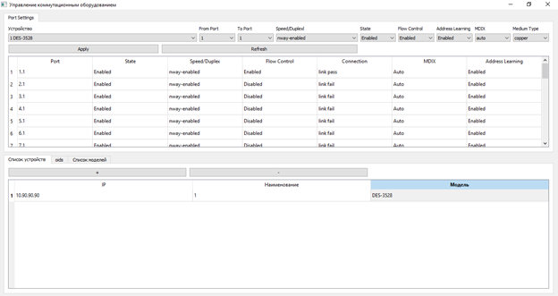
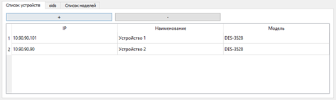
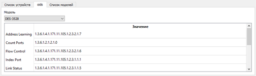

# **Утилита управления сетевым оборудованием**

**Статус:** Курсовая работа по дисциплине «Сети и телекоммуникации»  
**Цель:** Разработка программы для централизованного управления настройками портов коммутационных устройств по протоколу SNMP.

---

## 📌 **О проекте**

Программа предназначена для удалённого управления сетевыми коммутаторами через протокол **SNMPv2**. Позволяет просматривать и изменять настройки портов оборудования, а также вести базу устройств, моделей и соответствующих OID-идентификаторов.

**Ключевые особенности:**
*   **Управление портами:** Включение/отключение портов, настройка скорости, контроля потока, изучения MAC-адресов и режима MDIX.
*   **Поддержка нескольких устройств:** Хранение данных о различных моделях коммутаторов и их настройках в единой базе данных.
*   **Работа по SNMP:** Использование протокола SNMPv2 для безопасного и стандартизированного взаимодействия с оборудованием.
*   **Локальная база данных SQLite:** Хранение конфигураций устройств и OID в локальном файле.
*   **Интуитивный графический интерфейс:** Разработан на PyQt5, разделён на зоны настройки портов и управления базой данных.

**Важно:** Данный репозиторий содержит исходный код курсового проекта, сданный в качестве итоговой работы. Он предназначен для **ознакомления, оценки и демонстрации** реализованного функционала.

---

## 🗂️ **Структура репозитория**

```
├── README.md               # Эта документация
├── db.py                   # Модуль для работы с базой данных SQLite (класс DB)
├── snmp.py                 # Модуль для взаимодействия по SNMP (класс Device)
├── window.py               # Основной файл с графическим интерфейсом (класс Window)
├── db-com.db               # Файл базы данных SQLite (может быть пустым при первом запуске)
├── requirements.txt        # Список зависимостей Python (PyQt5, pysnmp)
└── screenshots/            # Папка со скриншотами интерфейса
    ├── device_list.png     # Список устройств
    ├── model_list.png      # Список моделей
    ├── oid_list.png        # Список OID для моделей
    └── port_settings.png   # Интерфейс настройки портов
```

---

## 🖥️ **Демонстрация интерфейса**

### 1. Основное окно настройки портов

*   **Выбор устройства:** Выпадающий список для выбора активного коммутатора.
*   **Таблица портов:** Отображение текущего состояния всех портов выбранного устройства.
*   **Панель настроек:** Установка параметров для выбранного диапазона портов (State, Speed/Duplex, Flow Control и т.д.).
*   **Кнопки управления:** `Apply` для применения настроек, `Refresh` для обновления данных с устройства.

### 2. Вкладка управления базой данных
**Список устройств:**


*   Добавление (`+`), редактирование (двойной клик), удаление (`-`) записей об оборудовании (IP-адрес, имя, модель).

**Список моделей:**


*   Управление перечнем поддерживаемых моделей коммутаторов.

**Список OID для моделей:**


*   Критически важная таблица. Для каждой модели здесь задаются OID-идентификаторы, которые программа использует для отправки SNMP-команд. От корректности этих данных зависит работа с устройством.

---

## ⚙️ **Технологический стек и архитектура**

*   **Язык программирования:** Python 3.9.7
*   **GUI-библиотека:** PyQt5
*   **База данных:** SQLite (библиотека `sqlite3`)
*   **Протокол управления:** SNMPv2 (библиотека `PySNMP`)
*   **Архитектура (разделение ответственности):**
    *   `db.py` (**Data Access Layer**): Класс `DB` — вся работа с локальной базой данных (устройства, модели, OID).
    *   `snmp.py` (**Business Logic / Network Layer**): Класс `Device` — инкапсулирует логику взаимодействия с сетевым оборудованием через SNMP (команды `getCmd`, `setCmd`, `bulkCmd`).
    *   `window.py` (**Presentation Layer**): Класс `Window` — реализация пользовательского интерфейса и обработка событий.

---

## 🧩 **Основные функции**

### Управление сетевым оборудованием:
*   **Получение данных:** Автоматическое заполнение таблицы текущими настройками портов выбранного коммутатора.
*   **Изменение настроек:** Пакетное применение конфигураций к выбранному диапазону портов:
    *   Состояние порта (Enable/Disable).
    *   Скорость и дуплекс (Speed/Duplex).
    *   Контроль потока (Flow Control).
    *   Изучение MAC-адресов (Address Learning).
    *   Режим MDIX (Auto/Normal/Cross).

### Управление базой данных программы:
*   **Устройства:** Добавление, редактирование и удаление записей о коммутаторах (IP, имя, привязка к модели).
*   **Модели:** Ведение списка поддерживаемых моделей оборудования.
*   **OID:** Настройка уникальных идентификаторов объектов SNMP для каждой модели. Это ключевой этап подключения нового типа устройства.

---

## 🔍 **Как ознакомиться с проектом**

1.  **Просмотр кода:**
    *   `snmp.py` — изучение реализации SNMP-запросов.
    *   `db.py` — структура базы данных и запросы.
    *   `window.py` — логика интерфейса и связи между модулями.

2.  **Анализ базы данных:** Файл `db-com.db` можно открыть в [DB Browser for SQLite](https://sqlitebrowser.org/) для просмотра таблиц `devices`, `models`, `oids`.

3.  **Просмотр интерфейса:** Скриншоты основных элементов интерфейса находятся в папке `screenshots/`.

4.  **Запуск (теоретический, требует настройки оборудования):**
    ```bash
    # Установка зависимостей
    pip install PyQt5 pysnmp
    # Запуск программы
    python window.py
    ```
    **Важно:**
    
    Для реальной работы необходимо:
    *   Физическое сетевое оборудование (например, коммутатор D-Link DES-3528) с включённым SNMP-агентом.
    *   Корректная сетевая связность между ПК и устройством.
    *   Предварительное заполнение базы данных: добавление модели, её OID и данных об устройстве.
